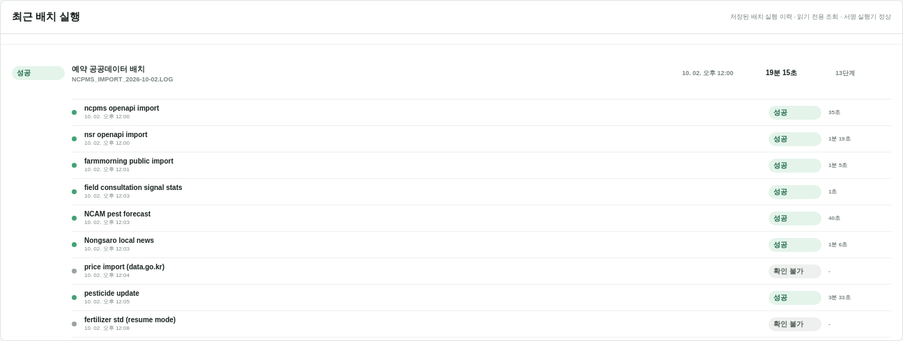
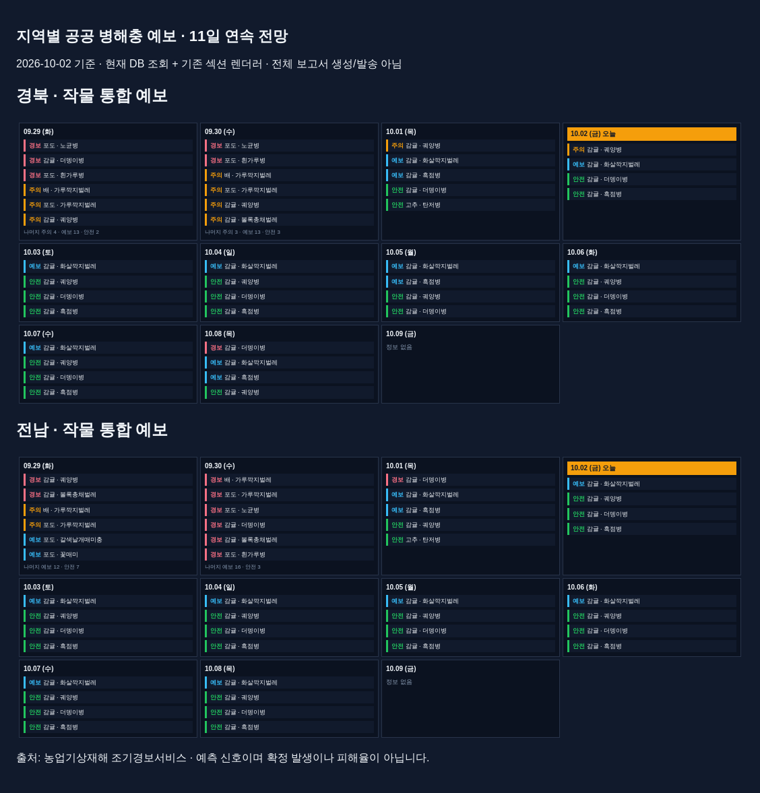
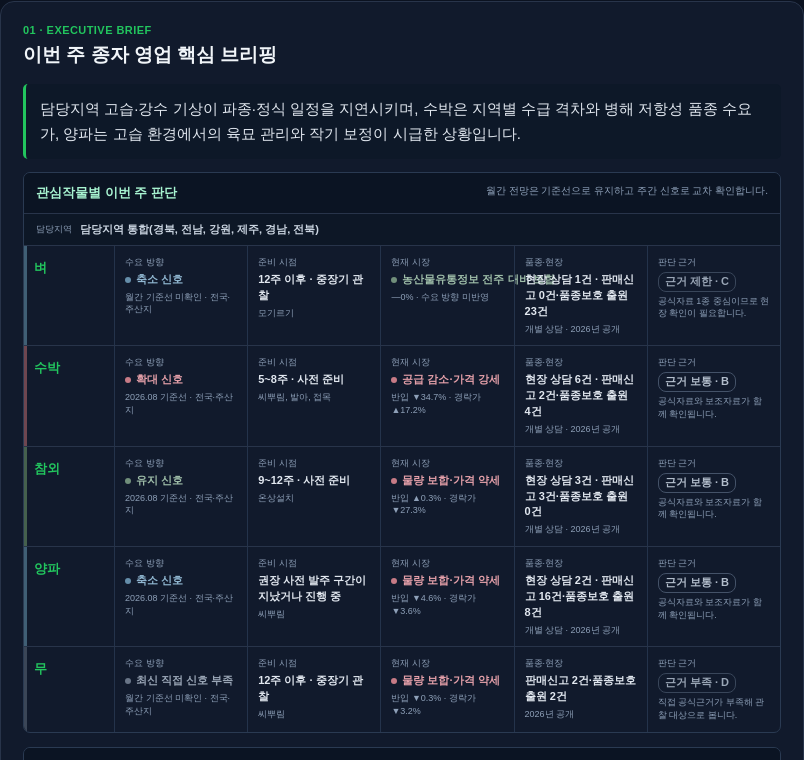
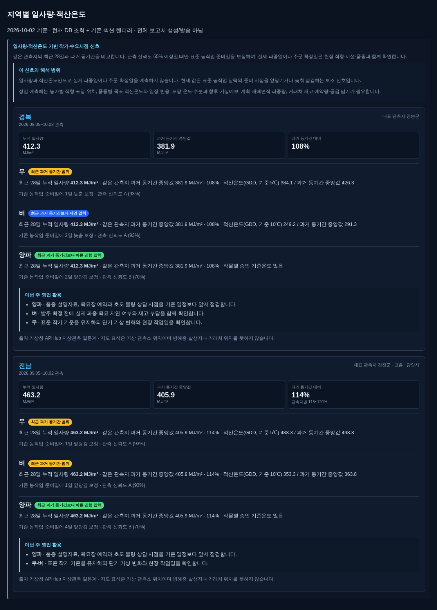

# AI Decision Support & Domain Intelligence Reporting

### Data Provenance · Human Validation · Domain Intelligence

[](https://github.com/YeongjoonKim/ai-domain-intelligence-reporting/actions/workflows/ci.yml)

## 실제 구현 경험

공공 관측·시장·기상·병해충·품종 정보를 통합해 **작물보호제와 종자 영업 의사결정**을 지원하는
개인화 리포트 파이프라인을 구현했습니다. 데이터 수집, 원문 검토, 정형 분석, LLM 설명,
HTML 생성, 품질 검토와 예약 발송을 연결하고 두 사업 영역의 빌더를 분리했습니다.

[Agent Harness](https://github.com/YeongjoonKim/reliable-domain-agent-harness)가 활용하는
도메인 데이터와 Evidence Pipeline의 설계·운영 경험을 정리합니다.

## 데이터에서 리포트까지

```text
Source → Collection → Extraction / Normalization → Structured Analysis
                                                            ↓
Report / Delivery ← Human Review ← LLM Assistance + Source Evidence
```

원천 자료의 버전·출처·단위·기간을 유지하면서 정형 계산과 LLM 해석을 분리합니다.
자료 검수와 보고서 미리보기·품질 검토를 거쳐 리포트 입력과 발송 상태를 관리합니다.

## Data & Workflow Facts

| 항목 | 구성 및 구현 |
|---|---|
| Business Domains | 작물보호제의 지역·병해충 대응, 종자의 수요·시장·품종 분석 |
| Data Sources | KREI·aT·도매경매·국립종자원·공식 재배 통계·기상·병해충 예보·전문가 상담 |
| Pipeline | 수집→검증·정규화→구조화 분석→LLM 인사이트→사람 검토→리포트 |
| KREI Processing | PDF/OCR·Qwen 보정·관리자 검수; 정형 지표와 정성 전망의 입력 경로 분리 |
| Source Validation | 문서 hash·current version·페이지 근거·검수 상태·승인 텍스트 hash |
| Report Builders | 작물보호제와 종자별 독립 builder, 지역·관심 작물에 따른 데이터 선택 |
| AI Role | 섹션별 근거 요약·편집과 종합 브리핑; 수치 계산은 정형 처리 |
| Human Review | 원문·보정문·최종본 비교, 품질 검사와 정책별 발송 승인 |
| Output | HTML/text 리포트, 종자 상세 PDF, 예보 달력·시장 비교·적산온도 |
| Delivery | 예약 발송, 수신 대상별 설정, staged artifact·품질·승인 상태 관리 구현 |

[구현 근거](docs/actual-engineering.md) · [소스별 규모·전처리·중간 산출물](docs/data-to-report.md).


## 수집 실행과 배치 운영



관리자 API와 별도 호스트 실행기를 통해 허용된 수집 단계·재시도를 요청하고 실행 이력을 조회합니다.
전체 실행 상태와 개별 단계의 성공·실패·확인 불가를 함께 관찰합니다.
화면은 기존 기록의 읽기 전용 조회이며, 촬영을 위해 수집이나 발송을 실행하지 않았습니다.
[제어 구조와 데이터에서 리포트까지의 연결](docs/batch-operations.md).

## 작물보호제 리포트

지역·관심 작물을 기준으로 공식 병해충 정보, 기상, 시장·현장 신호를 조합합니다.
섹션별 LLM 정리와 종합 인사이트, 품질 검사, 발송 전 미리보기를 연결했습니다.


병해충·기상·현장 신호를 조합한 미리보기에서 지역별 대응과 영업 검토 항목을 살펴봅니다.

### 지역·날짜별 병해충 예보



경북·전남의 작물별 예측 신호를 날짜별로 비교하고 자료가 없는 날을 구분합니다.
DB 조회 결과를 기존 리포트 섹션 렌더러에 연결한 화면입니다.

## 종자 리포트

KREI 관측과 재배의향·면적 신호, 가격·반입량, 품종·판매등록, 파종·육묘·정식 일정을
종자 수요 맥락으로 정리합니다. 종자 공급량과 재배면적은 서로 다른 지표로 취급합니다.


지역·작물별 영업 검토 항목과 근거 충족 상태를 함께 표시합니다.

시장·가격과 전체 미리보기는 [화면 갤러리](docs/screenshots.md)에 있습니다.

### 핵심 인사이트와 적산온도



저장된 보고서의 첫 브리핑입니다. 작물별 수요 방향·준비 시점·시장·품종 신호와 근거 수준을 함께 제시합니다.



DB 조회 결과를 기존 섹션 렌더러에 연결한 일사량·적산온도 비교입니다.
동일 관측소의 최근 28일과 과거 동기간을 비교하고 profile 적용 여부·관측 신뢰도를 표시합니다.
파종·육묘 준비를 검토하는 환경 보조 지표로 사용합니다.

리포트 예시는 저장본, 예보·적산온도는 DB 기반 섹션 화면입니다.
[자료 기준일과 캡처 범위](docs/screenshots.md#added-forecast-degree-days-and-insight)를 함께 제공합니다.

## 데이터 규모와 활용 범위

| 데이터 | 저장 규모 |
|---|---|
| KREI | 문서 버전 82행, 고유 content hash 21개 · 페이지 937 · 지표 후보 1,526 |
| 시장 | 전국 가격 76,080 · 지역 가격 567,637 · 경매 750,767행 |
| 기상 | 관측소 97 · 일 관측 8,982행 · 지역/작물 매핑 101 |
| 병해충 | 공식 회보 259 · 회보 항목 4,281 · 지역 일별 예보 39,269행 |
| 등록·통계 | 약제 등록 134,750 · 품종보호 1,246 · 판매신고 462 · 재배 통계 12,475행 |

2026-10-02 집계이며 이력·버전 중복을 포함합니다. 목적별 필터와 검수 조건을 거쳐 리포트 입력을 선택합니다.
5작물·6지역 조회에서 가격 5작물, 경매 신호 4작물, 재배 통계 105행, 농업기상 30개 신호를 선택했습니다.
[40개 테이블의 집계](docs/data-inventory-20261002.json)와 [저장량→적격량→선택량](docs/data-to-report.md)을 구분해 제공합니다.

## 데이터 연결과 검수


KREI·주간농사정보·기상·도매가격·경매의 연결 상태와 적재 현황입니다.
비활성 데이터 소스도 연결 상태와 함께 구분해 표시합니다.

전체 소스 분류와 테이블 역할은 [구현 근거](docs/actual-engineering.md)에 정리했습니다.

### KREI: 원문 수집·LLM 보정·사람 검수

`Data Acquisition → PDF / OCR → LLM Refinement → Human Validation → Report Input`


9월호의 작물별 원문·Qwen 보정문·관리자 최종본과 근거 페이지를 비교하는 검수 화면입니다.

KREI 정형 지표는 current 보고서의 검수 상태와 지표의 AUTO_VALIDATED / APPROVED 상태를
함께 검사합니다. REVIEW_REQUIRED 보고서는 이 정형 사실 경로에서 제외합니다.
정성 전망은 별도 경로로 원문 또는 승인된 편집·LLM 보정문을 사용하며,
조건을 충족하는 작물 텍스트가 없으면 페이지 추출문과 지표 교정문으로 보완합니다.
미승인 LLM 보정문을 자동 채택하거나 정성 문장을 정형 수치로 승격하지 않습니다.
[텍스트 선택 순서와 승인 경로](docs/data-to-report.md#2-storage-is-not-report-eligibility)를 구분해 설명합니다.

## 시스템 설계의 강점

| 설계 | 구현 효과 |
|---|---|
| Multi-source integration | 문서·시계열·등록정보·현장 신호를 목적별로 조합 |
| Source semantics | 단위·시점·지역·재배형태를 유지하고 상이한 지표의 오용 방지 |
| Source review | 원문 버전·페이지·추출/보정/최종 텍스트를 연결 |
| Separate builders | 작물보호제와 종자 해석을 분리하고 운영 기반은 공유 |
| Generation / Delivery separation | 보고서 artifact·품질 검토·예약 전달을 별도 단계로 관리 |

수집·정규화·KREI·리포트 상세는 이 저장소에서 설명합니다.
[Harness](https://github.com/YeongjoonKim/reliable-domain-agent-harness)는 해당 데이터를 호출하고 근거로 사용하는 실행 책임을 다룹니다.

## 공개 구현 범위

상단 아키텍처에서 운영 수집·리포트 흐름과 PUBLIC EXECUTABLE EXAMPLE을 구분합니다.

| 구분 | 범위 |
|---|---|
| 운영 시스템 | 수집·DB 연결·LLM 리포트·검수·발송 관리 기능 |
| Public Reference Implementation | 시점·단위·출처 계약과 정형 비교를 독립 코드로 재구성 |
| Public Lightweight Demo | 합성 JSON → Decimal 산술 → evidence-linked Markdown / HTML |

공개 예제는 값·단위·날짜·projection과 기간 충돌·이력 부족 처리를 테스트로 검증합니다.
[실행 artifact](examples/execution.json) · [공개 실행 화면](docs/screenshots.md#public-execution).

## 실행 및 검증

```sh
python3 -m src.report_demo
python3 -m src.export_evidence
python3 -m src.render_evidence
python3 -m unittest discover -s tests -v
python3 scripts/check_repository.py
```

## 현재 범위와 한계

공개 코드는 합성 입력의 정형 비교·근거 연결·렌더링을 재현하며, 운영 파이프라인은 문서와 화면으로 설명합니다.
제목 한글화와 품질 검사 간 계약 불일치, 실행별 근거 사용량 추적과 독립 보고서 품질 평가가 후속 과제입니다.
Staged delivery는 구현 근거와 운영 실적을 구분하고, 내부 품질 점수는 전문가 정확도·사업 효과와 별도로 평가합니다.
[미해결 항목과 회귀 결과](docs/data-to-report.md#6-validation-findings-not-hidden-success-claims)를 공개 테스트와 함께 관리합니다.

[상세 근거](docs/actual-engineering.md) · [평가](docs/evaluation.md) ·
[검증 기록](docs/validation.md) · [공개 경계](PUBLICATION.md) ·
[License notice](LICENSE-NOTICE.md) · [Security](SECURITY.md).
