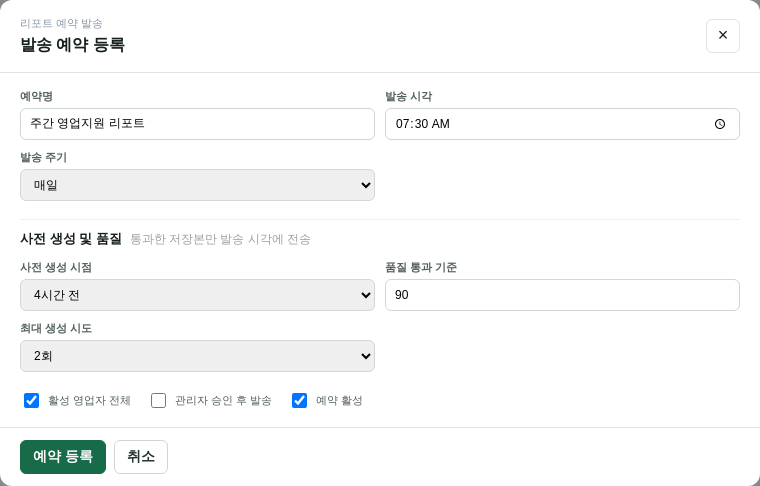
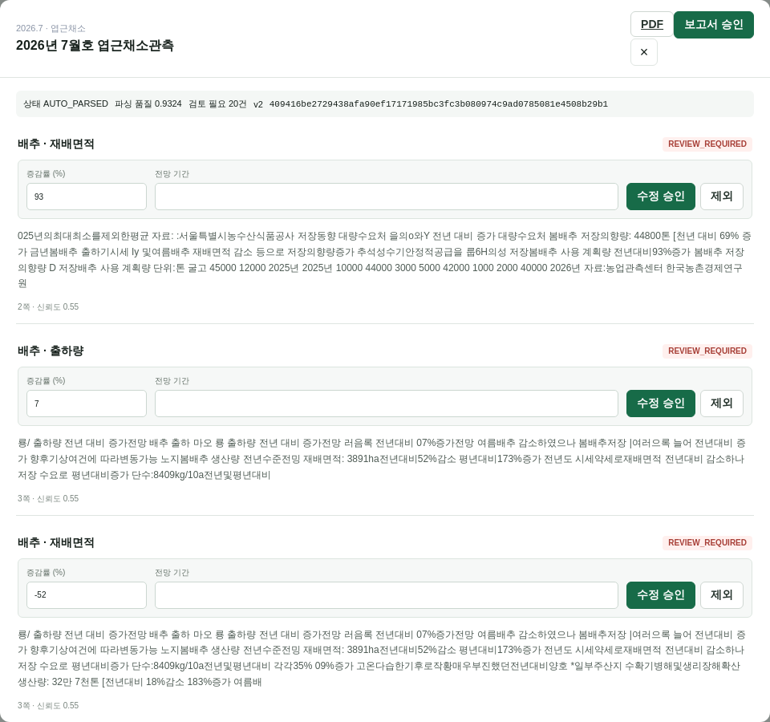
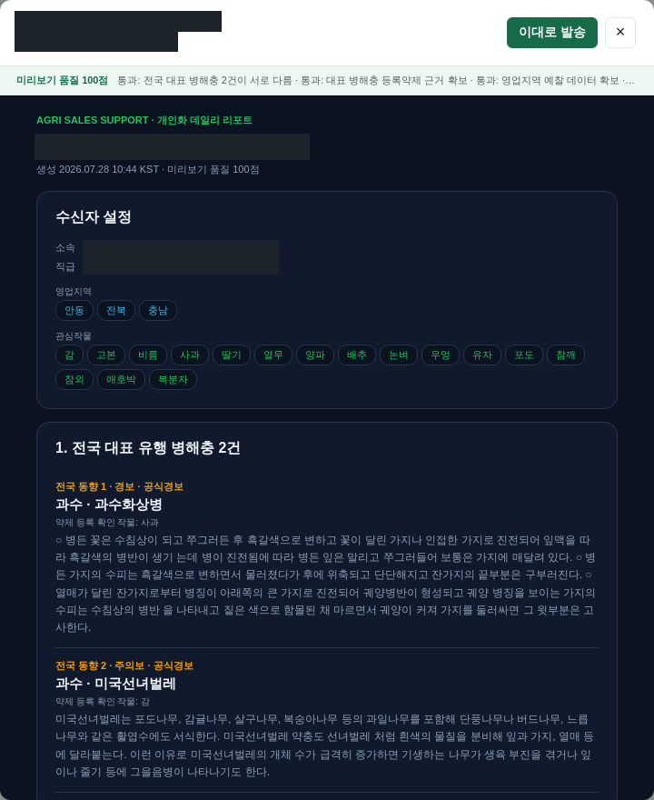
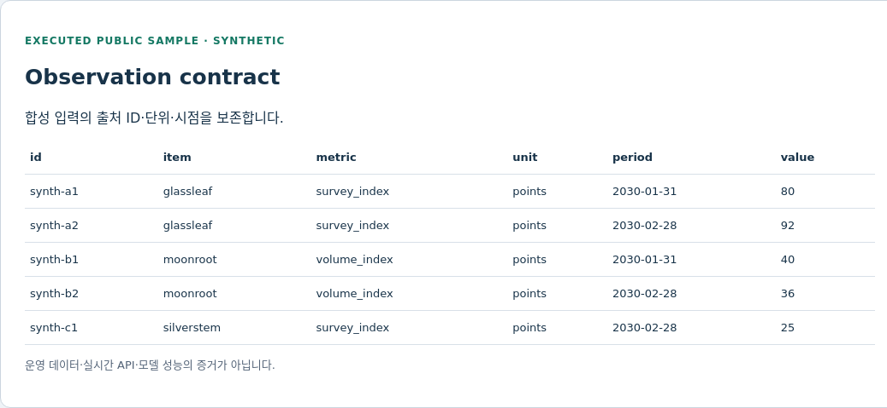
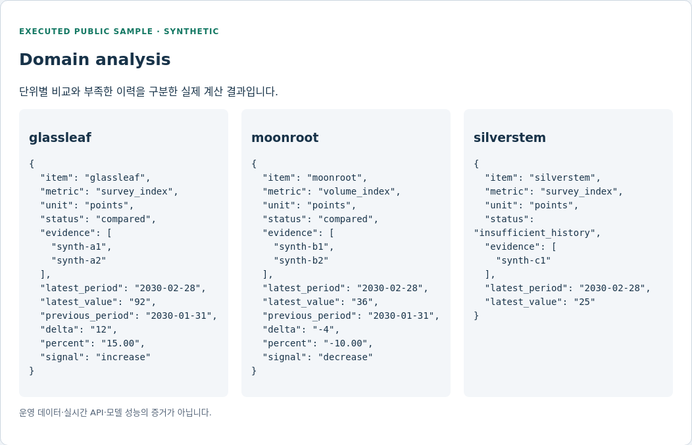
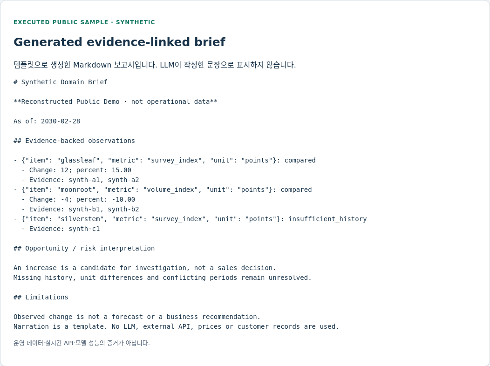

# AI Decision Support & Domain Intelligence Reporting

### 데이터의 시점·단위·출처를 보존하는 근거 중심 Decision-support Pipeline

[](https://github.com/YeongjoonKim/ai-domain-intelligence-reporting/actions/workflows/ci.yml)

## 어떤 의사결정을 지원하는가

서로 다른 관측을 그럴듯한 문장으로 합치는 것보다, **비교 가능한 데이터인지 판단하는 일**이 먼저입니다.
이 예제는 합성 시계열을 검증하고 지표·단위를 분리해 변화량과 근거 ID를 보고합니다.
상승을 곧바로 사업 기회로, 부족한 이력을 곧바로 감소 추세로 단정하지 않습니다.

원래의 데이터 통합·보고 자동화 경험에서 공개 가능한 작은 실행 경계를 재구성했습니다.
직원·고객의 식별 정보와 운영 데이터셋은 포함하지 않습니다.
별도로 승인된 운영 UI 사본은 크롭·불투명 마스킹하여 실제 구현 경험을 보여줍니다.

This repository is a sanitized and reconstructed technical showcase based on engineering experience from a private production AI platform.
It excludes proprietary source code, credentials, personal identifiers and deployable production configuration.
Owner-approved operational UI crops are clearly separated from the executable synthetic sample.

## Architecture / Data Pipeline


Reference flow: Data Sources → Collection → Validation → Normalization → Domain Analysis
→ LLM Insight → Opportunity / Risk → Report Generation.

현재 실행 범위는 **합성 JSON → 검증 → 정형 비교 → 템플릿 보고서**입니다.
**공개 실행 코드 기준** 실수집 connector, LLM Insight, 발송 scheduler와 관리자 설정 서비스는 PROPOSED입니다.
아래 운영 화면은 별도 비공개 플랫폼에서 구현한 기능의 증거이며 공개 코드의 기능표와 혼동하지 않습니다.
도식에서 설계 영역과 실행 영역을 구분합니다.

## Operational Implementation Evidence

다음 세 장은 기존 운영 관리자 캡처의 공개용 사본입니다. 회사 표시·계정 목록은 크롭으로 제외하고,
리포트의 직원 이름·이메일·소속 정보는 불투명 마스킹했습니다. UI 값이나 결과를 합성 값으로 바꾸지 않았습니다.

### 관리 / 발송 설정



- **무엇을 보여주는가:** 발송 주기·사전 생성·품질 기준·생성 시도·승인 옵션을 관리하는 UI.
- **현재 구현 범위:** 운영 관리자 설정 화면; 이 저장소의 scheduler 구현은 아님.
- **Known Limitation:** 설정 화면만으로 예약 실행이나 이메일 수신 성공을 입증하지 않습니다.
- **Research Relevance:** 생성과 전달을 분리하고 품질 gate를 통과한 결과만 전달하는 설계.

### 수집 자료 / 분석 검토



- **무엇을 보여주는가:** 수집 보고서에서 추출한 지표·근거 문맥을 사람이 수정 승인하거나 제외하는 화면.
- **현재 구현 범위:** AUTO_PARSED와 REVIEW_REQUIRED를 구분한 검토 workflow.
- **Known Limitation:** 보이는 추출 값은 검토 대기 후보이며 확정 통계가 아닙니다. 파싱 품질 수치도 모델 정확도가 아닙니다.
- **Research Relevance:** 자료 수집과 신뢰 가능한 insight 사이에 사람의 검토 경계를 배치.

### 생성 Report / 미리보기



- **무엇을 보여주는가:** 관심 작물·지역과 공식 병해충 정보를 조합한 개인화 보고서의 기존 미리보기.
- **현재 구현 범위:** 캡처 당시 생성 결과의 일부와 발송 전 검토 UI.
- **Known Limitation:** 화면의 품질 점수는 내부 검사 값이며 전문가 정확도나 사업 성과가 아닙니다. 과거 발생 정보는 현재 예보로 해석하지 않습니다.
- **Research Relevance:** 분석 근거에서 사용자별 의사결정 지원으로 연결되는 정보 전달 설계.

## Public Execution Evidence 1 — 입력 계약과 기준 시점



- **무엇을 보여주는가:** 원본 ID, 대상, metric, unit, 관측일을 보존한 공개 입력.
- **현재 구현 범위:** synthetic origin, 날짜, 유한 수치, 식별자와 중복 ID 검증.
- **Known Limitation:** 공식 통계가 아닌 가상 관측이며 실제 수집 UI가 아닙니다.
- **Research Relevance:** temporal validity와 source identity를 생성 이전에 보존.

## Public Execution Evidence 2 — 비교 가능한 관측과 미해결 상태



가상 `glassleaf` 지표는 80→92로 **+12 points, +15%**입니다.
`moonroot`는 감소하고, `silverstem`은 비교 이력이 부족해 `insufficient_history`로 남습니다.
이 값은 실제 작물·시장·운영 성과가 아닙니다.

- **무엇을 보여주는가:** 실제 Python 계산 결과와 각 결론의 근거 ID.
- **현재 구현 범위:** Decimal 산술, metric/unit 분리, 동일 기간 충돌 처리.
- **Known Limitation:** 인과 추론·수요 예측·영업 우선순위는 계산하지 않습니다.
- **Research Relevance:** 생성 문장보다 앞선 데이터 의미 검증과 unresolved 상태 보존.

## Public Execution Evidence 3 — Evidence-linked Report



- **무엇을 보여주는가:** 분석 결과로부터 실제 생성한 Markdown brief.
- **현재 구현 범위:** 근거를 포함한 템플릿 생성과 정형 projection 일치 검사.
- **Known Limitation:** LLM 작성 문장이나 실제 개인화 리포트 화면이 아닙니다.
- **Research Relevance:** 수치 산출과 설명 생성을 분리해 검증 가능성을 높임.

이 절의 세 화면은 [실행 snapshot](examples/execution.json)을 렌더링한 **공개 검토 문서**입니다.
위 Operational Implementation Evidence와 달리 관리자 서비스가 아닌 공개 실행 문서입니다.
[HTML 문서](examples/execution.html) · [화면 설명](docs/screenshots.md).

## LLM의 역할과 Automation 경계

LLM은 검증된 관측을 설명하고 검토 질문을 정리하는 역할로 설계합니다.
숫자·날짜·단위를 자유 생성하거나 출처를 대신 판단하도록 맡기지 않습니다.

| 구성 | 상태 | 실행 범위 |
|---|---|---|
| Validation / Normalization | IMPLEMENTED | 합성 origin, 값·날짜·ID 계약 |
| Domain Analysis | IMPLEMENTED | 독립 단위별 변화량과 충돌/이력 부족 |
| Evidence / Report | IMPLEMENTED | fixture ID, 템플릿 문장 |
| Structured projection guard | PARTIAL | 정형 insight 비교; 자유 문장 검증 아님 |
| LLM Insight / Collection / Scheduler / Admin Config | PROPOSED | connector·주기 실행·설정 UI 미포함 |

## Evaluation / Failure Analysis

22개 테스트가 수치 오류·미래 관측·중복·단위 차이·0 기준값·기간 충돌·변조된 projection,
실행 artifact/HTML 일치와 저장소 검사기를 검증합니다.
0 기준값의 증감률은 undefined이며 다른 단위는 합치지 않습니다.
합성 회귀 통과를 실제 사업 판단의 정확도로 환산하지 않습니다.

[평가 범위](docs/evaluation.md) · [설계 결정](docs/design-decisions.md) ·
[한계](docs/limitations.md) · [검증 기록](docs/validation.md).

## Reproduce

Python 3.10+ 표준 라이브러리. GPU·네트워크·LLM·DB 없이 실행합니다.

```sh
python3 -m src.report_demo
python3 -m src.export_evidence
python3 -m src.render_evidence
python3 -m unittest discover -s tests -v
python3 scripts/check_repository.py
```

export/render는 표준 출력으로 결과를 내보냅니다. snapshot 테스트가 저장된 JSON/HTML과
재계산 결과를 비교하므로 README 화면의 근거를 코드에서 따라갈 수 있습니다.

`src/`: 검증·분석·render, `examples/`: 합성 입력과 실제 출력,
`tests/`: 회귀, `docs/`: 도식·화면·평가, `.github/`: CI.

## Research Relevance

시간에 따라 달라지는 자료의 신뢰도, 서로 다른 출처의 충돌, 정형 수치와 자연어 설명의 일치,
사람에게 실제로 유용한 의사결정 지원을 평가하는 방향으로 확장할 수 있습니다.
실제 도입 전에는 독립적인 전문가 평가와 오류 비용 정의가 필요합니다.

MY CONTRIBUTION: 데이터/보고 engineering 경험. PLATFORM CONTEXT: 비공개 의사결정 지원.
PUBLIC RECONSTRUCTION: 독립 합성 pipeline. FUTURE RESEARCH: 실자료·LLM 기반 평가.

[공개 경계](PUBLICATION.md) · [License notice](LICENSE-NOTICE.md) · [Security](SECURITY.md).
라이선스를 임의로 부여하지 않았습니다.
