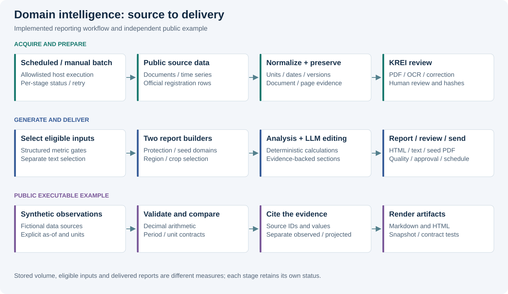
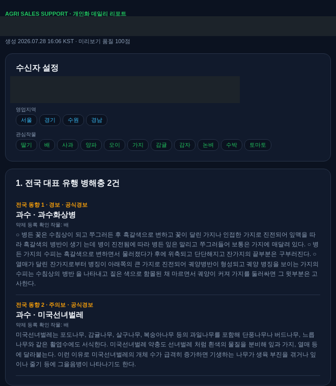
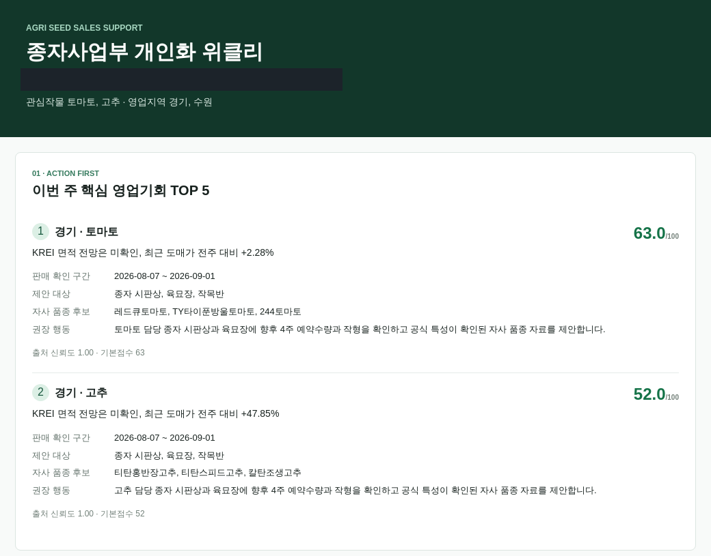
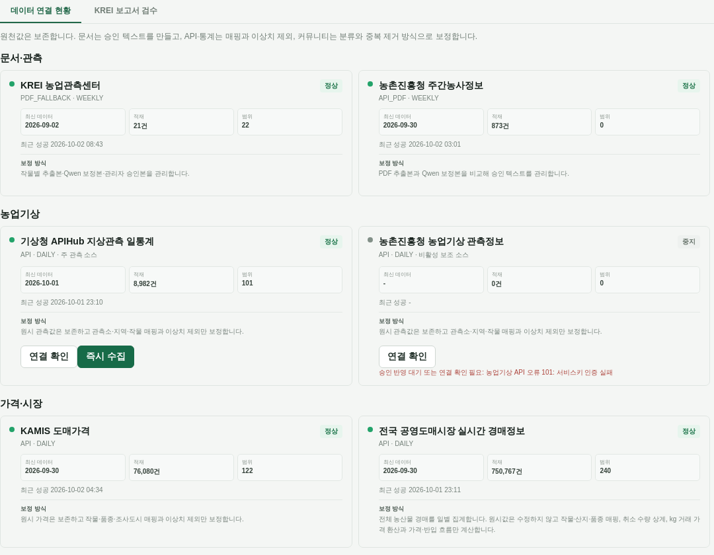
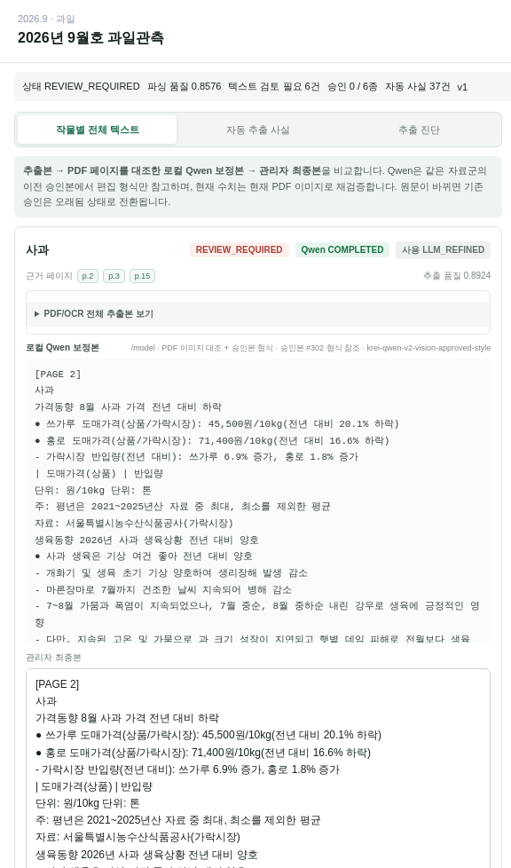

# AI Decision Support & Domain Intelligence Reporting

### Multi-source Data · Source Review · LLM Insight · Personalized Reports

[](https://github.com/YeongjoonKim/ai-domain-intelligence-reporting/actions/workflows/ci.yml)

## Actual Engineering Experience

공공 관측·시장·기상·병해충·품종 정보를 통합해 **작물보호제와 종자 영업 의사결정**을 지원하는
개인화 리포트 파이프라인을 구현했습니다. 데이터 수집, 원문 검토, 정형 분석, LLM 설명,
HTML 생성, 품질 검토와 예약 발송을 연결하고 두 사업 영역의 빌더를 분리했습니다.



External Sources → Collection → Validation / Normalization → Domain Storage
→ Structured Analysis → LLM Insight → Report → Review / Delivery.

## Use Case A — Crop Protection Intelligence

지역·관심 작물을 기준으로 공식 병해충 정보, 기상, 시장·현장 신호를 조합합니다.
섹션별 LLM 정리와 종합 인사이트, 품질 검사, 발송 전 미리보기를 연결했습니다.

**Purpose** — 생성 결과를 수신 대상·지역·작물 맥락에서 검토합니다.



**What this demonstrates** — 실제 작물보호제 리포트 미리보기. 직원 이름·이메일·소속은 불투명 마스킹했습니다.
**Architecture relation** — Domain analysis → Generated Report → Human Review.

## Use Case B — Seed Sales Intelligence

KREI 관측과 재배의향·면적 신호, 가격·반입량, 품종·판매등록, 파종·육묘·정식 일정을
종자 수요 맥락으로 정리합니다. 종자 공급량과 재배면적은 서로 다른 지표로 취급합니다.

**Purpose** — 원천 관측을 종자 수요·영업 검토 항목으로 전달합니다.



**What this demonstrates** — 실제 저장된 종자 리포트의 지역·작물별 영업 검토 항목과 근거 부족 상태를 다시 렌더링한 화면.
과거 생성 시점의 결과이며 현재 시장 예측으로 제시하는 자료는 아닙니다.
**Architecture relation** — Structured Market Data → Seed Report.

시장·가격과 전체 미리보기는 [추가 Report Evidence](docs/screenshots.md)에 있습니다.

## Data Integration & Source Validation

**Purpose** — 어떤 소스가 연결되고 실제 적재되었는지, 최신 시점과 보정 방식을 확인합니다.



**What this demonstrates** — KREI·주간농사정보·기상·도매가격·경매의 연결 상태와 적재 현황.
중지된 보조 소스도 상태를 보존해 표시합니다.
**Architecture relation** — Sources → Collection → Source Health / Normalization.

전체 소스 분류와 테이블 역할은 [Data & Workflow Evidence](docs/actual-engineering.md)에 정리했습니다.

### September KREI Review

**Purpose** — PDF/OCR 추출본, Qwen 보정본, 관리자 최종본을 비교합니다.



**What this demonstrates** — 실제 2026년 9월호 검수 모달의 작물별 텍스트·근거 페이지·검토 상태.
촬영 당시 REVIEW_REQUIRED를 승인 완료로 바꾸지 않았습니다.
**Architecture relation** — Extraction → LLM Refinement → Human Validation → Report Input.

현재 코드는 승인 텍스트 hash의 변경을 검사하고, 수치는 AUTO_VALIDATED / APPROVED 행을 선별합니다.
추출 후보·검증된 수치·최종 승인 텍스트를 같은 상태로 취급하지 않습니다.

## System Strengths

| Decision | 구현 효과 |
|---|---|
| Multi-source integration | 문서·시계열·등록정보·현장 신호를 목적별로 조합 |
| Source semantics | 단위·시점·지역·재배형태를 보존하고 상이한 지표의 오용 방지 |
| Source review | 원문 버전·페이지·추출/보정/최종 텍스트를 연결 |
| Separate builders | 작물보호제와 종자 해석을 분리하고 운영 기반은 공유 |
| Generation / Delivery separation | 보고서 artifact·품질 검토·예약 전달을 별도 단계로 관리 |

수집·정규화·KREI·리포트 상세는 이 저장소에서 설명합니다.
[Harness](https://github.com/YeongjoonKim/reliable-domain-agent-harness)는 해당 데이터를 호출하고 근거로 사용하는 실행 책임을 다룹니다.

## Public Reference Implementation & Lightweight Demo

| 구분 | 범위 |
|---|---|
| Actual Engineering Experience | 실제 수집·DB 연결·LLM 리포트·검수·발송 운영 기능 |
| Public Reference Implementation | 시점·단위·출처 계약과 정형 비교를 독립 코드로 재구성 |
| Public Lightweight Demo | 합성 JSON → Decimal 산술 → evidence-linked Markdown / HTML |

공개 예제는 fixture의 +12 points / +15% 등을 재계산하고 기간 충돌·이력 부족을 보존합니다.
[실행 artifact](examples/execution.json) · [공개 실행 화면](docs/screenshots.md#public-execution).
22개 테스트가 값·단위·날짜·충돌·projection·snapshot을 검증합니다.

## Reproduce

```sh
python3 -m src.report_demo
python3 -m src.export_evidence
python3 -m src.render_evidence
python3 -m unittest discover -s tests -v
python3 scripts/check_repository.py
```

## Scope & Limitations

운영 코드·직원/고객 데이터·발송 설정은 공개하지 않습니다.
화면의 품질 점수는 내부 검사 지표이며 사업 성과나 전문가 정확도와 구분합니다.
현재 연결 상태와 과거 생성 리포트는 관측 시점이 다릅니다.
공개 실행 예제는 합성 입력과 템플릿을 사용하며 실제 수집·LLM·발송 서비스는 문서·화면으로 설명합니다.

[상세 근거](docs/actual-engineering.md) · [평가](docs/evaluation.md) ·
[검증 기록](docs/validation.md) · [공개 경계](PUBLICATION.md) ·
[License notice](LICENSE-NOTICE.md) · [Security](SECURITY.md).
